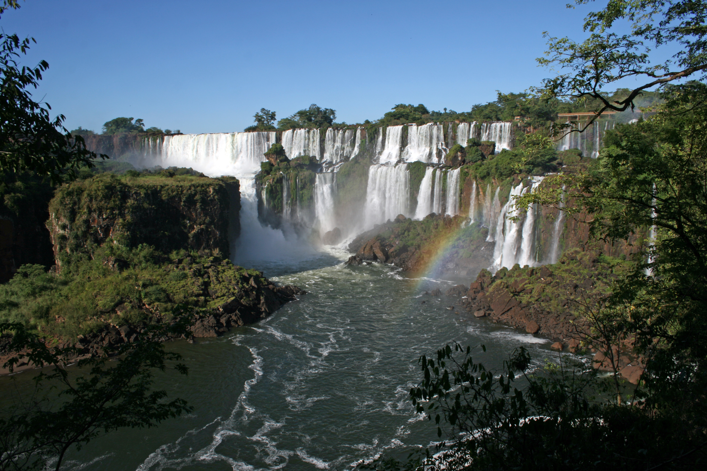
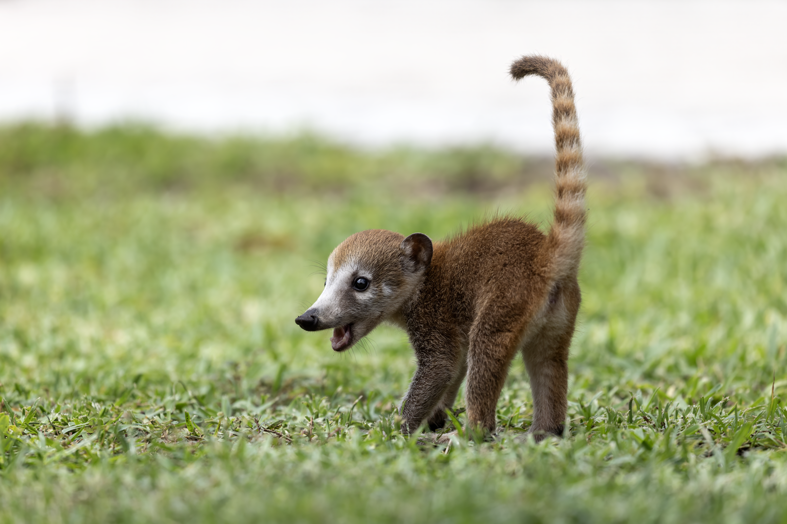
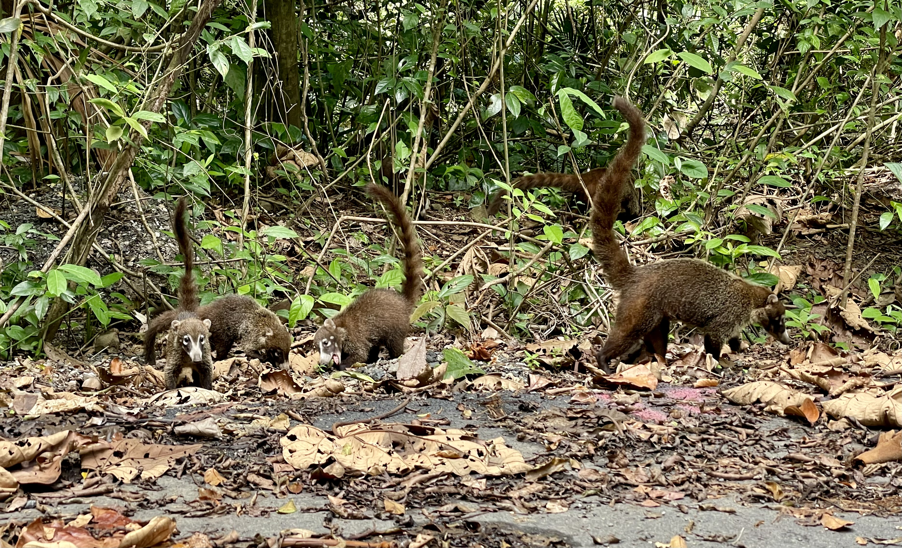
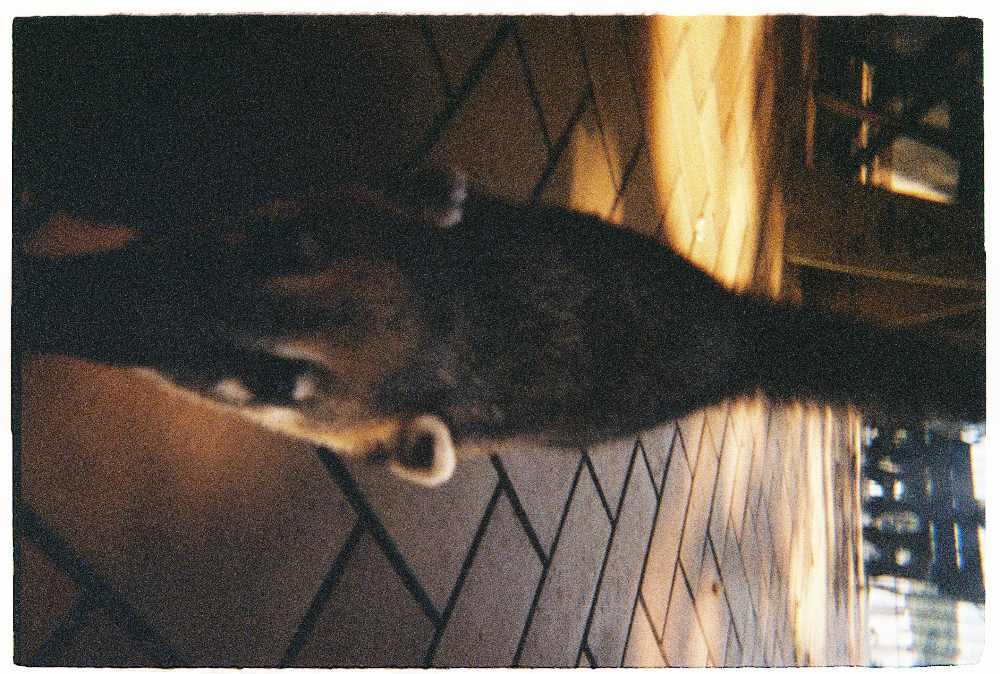
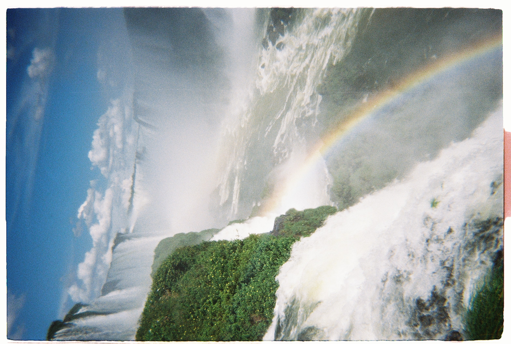

 By <a href="//commons.wikimedia.org/w/index.php?title=User:Enaldo_Valadares&amp;action=edit&amp;redlink=1" target="_blank">Enaldo Valadares</a> - Own work, <a href="https://creativecommons.org/licenses/by-sa/3.0" target="_blank">CC BY-SA 3.0</a>, <a href="https://commons.wikimedia.org/w/index.php?curid=32922684" target="_blank">Link</a>

> yguasu - Monorepo for all Incubating Projects by [Coati Dev](https://github.com/coati-dev) — the developer mascot of [Timeless Relic](https://timelessrelic.com/).

---

## The Name: Y Guasu

In the **Guaraní language**, "great water" is translated as:

> **"y guasu"**
>
> - **y** = water
> - **guasu** = big / great — and also *deer*

So *y guasu* literally means **"great water"** or **"big water"** — the origin of the name **Iguaçu**, one of the most breathtaking waterfall systems on Earth.

 By <a href="//commons.wikimedia.org/wiki/User:Tomfriedel" target="_blank">Tomfriedel</a> - Own work, <a href="https://creativecommons.org/licenses/by/3.0" target="_blank">CC BY 3.0</a>, <a href="https://commons.wikimedia.org/w/index.php?curid=4161991" target="_blank">Link</a>

---

## Iguaçu: Home of the Coatis

Iguaçu is not only famous for its waterfalls — it is also the **natural home of the coati** (*Nasua nasua*).

A **coati** is a social, curious, and highly intelligent mammal native to South and Central America. Related to raccoons, coatis are known for their long, flexible snouts, ringed tails held high in the air, and their tendency to roam in groups called **bands** or **troops**. They are a familiar sight along the trails of Iguaçu National Park, fearlessly exploring their surroundings with boundless energy and adaptability.

 By <a href="//commons.wikimedia.org/wiki/User:Needsmoreritalin" target="_blank">Chuck Homler, Focus On Wildlife</a> - Own work, <a href="https://creativecommons.org/licenses/by-sa/4.0" target="_blank">CC BY-SA 4.0</a>, <a href="https://commons.wikimedia.org/w/index.php?curid=151596700" target="_blank">Link</a>

 By <a href="//commons.wikimedia.org/w/index.php?title=User:BlundiesBestBoots&amp;action=edit&amp;redlink=1" target="_blank">BlundiesBestBoots</a> - Own work, <a href="https://creativecommons.org/licenses/by-sa/4.0" target="_blank">CC BY-SA 4.0</a>, <a href="https://commons.wikimedia.org/w/index.php?curid=168552310" target="_blank">Link</a>

<table>
<tr>
<td align="center" width="50%">
 
Coati at Iguaçu
</td>
<td align="center" width="50%">
 
Rainbow at Garganta do Diabo
</td>
</tr>
</table>

Photos by <a href="https://carneiro.pt" target="_blank">@mig4ng</a> · Shot on analog Kodak M35

---

## Meet Coati the Developer

**Coati** is the mascot of [Timeless Relic](https://timelessrelic.com/) and the spirit of this monorepo. Like the real coati — social, sharp-eyed, and always building — Coati the developer is here to explore, create, and ship.

- GitHub: [github.com/TimelessRelic](https://github.com/TimelessRelic)
- Coati Dev: [github.com/coati-dev](https://github.com/coati-dev)

---

## This Monorepo

**yguasu** ([github.com/coati-dev/yguasu](https://github.com/coati-dev/yguasu)) is the home for all **Incubating Projects** — inspired by the [Cloud Native Computing Foundation (CNCF)](https://www.cncf.io/projects/) model of nurturing projects from idea to maturity.

| Stage | Location |
|---|---|
| 🌱 **Incubating** | [github.com/coati-dev/yguasu](https://github.com/coati-dev/yguasu) |
| 🎓 **Graduated** | [github.com/TimelessRelic](https://github.com/TimelessRelic) |

Projects start here, grow here, and graduate to [TimelessRelic](https://github.com/TimelessRelic) when they're ready.
