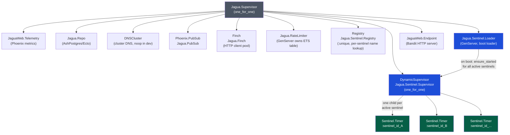
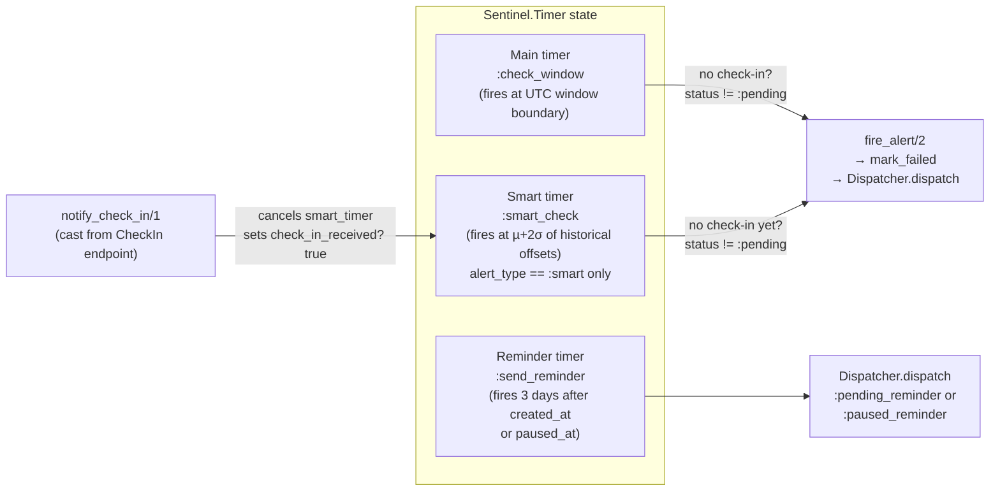
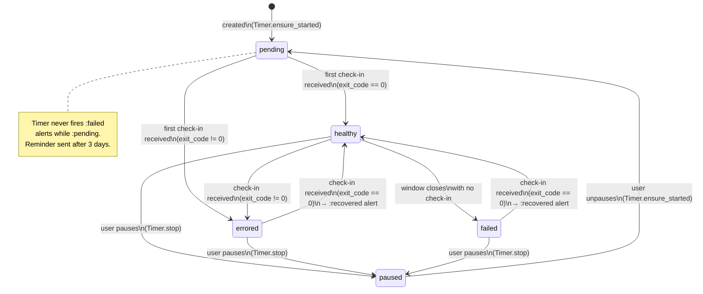
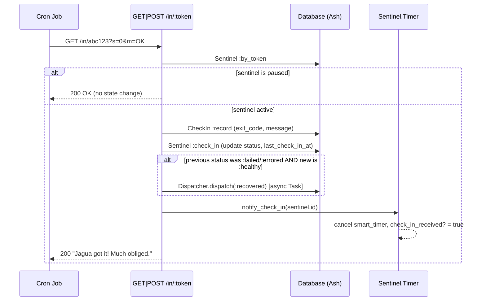
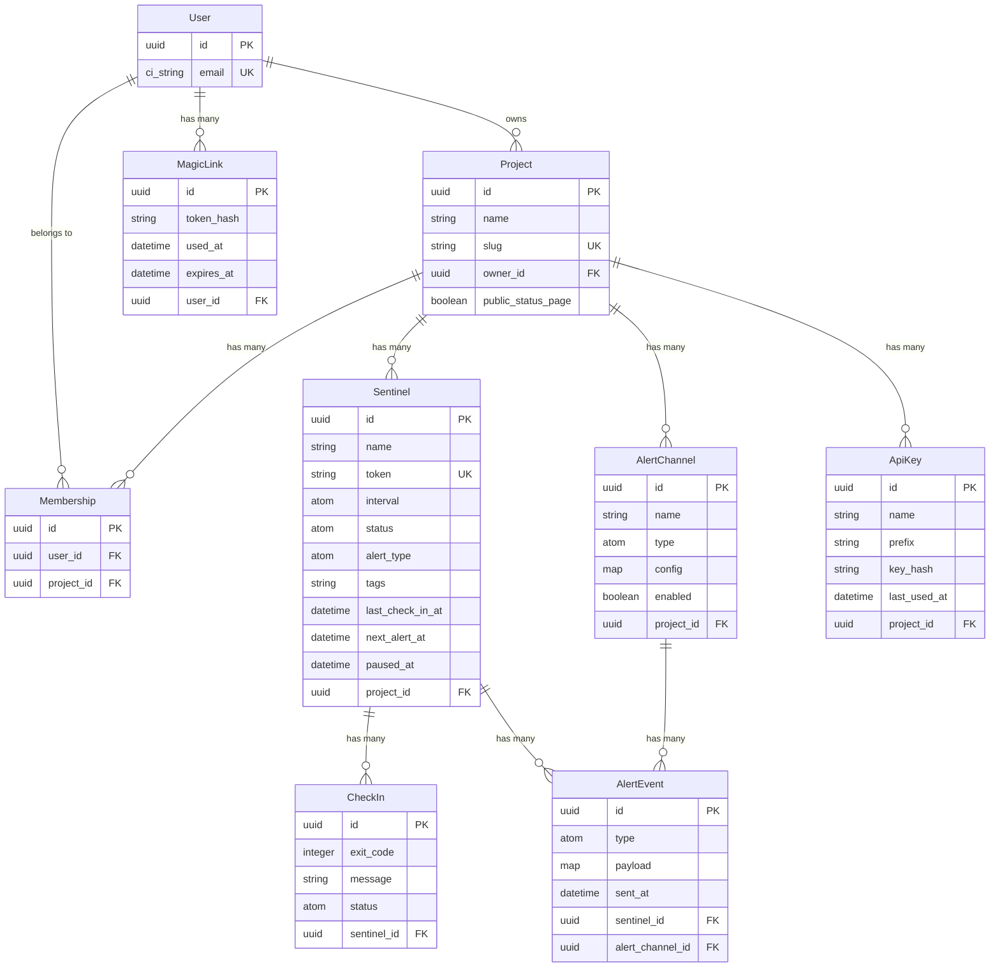
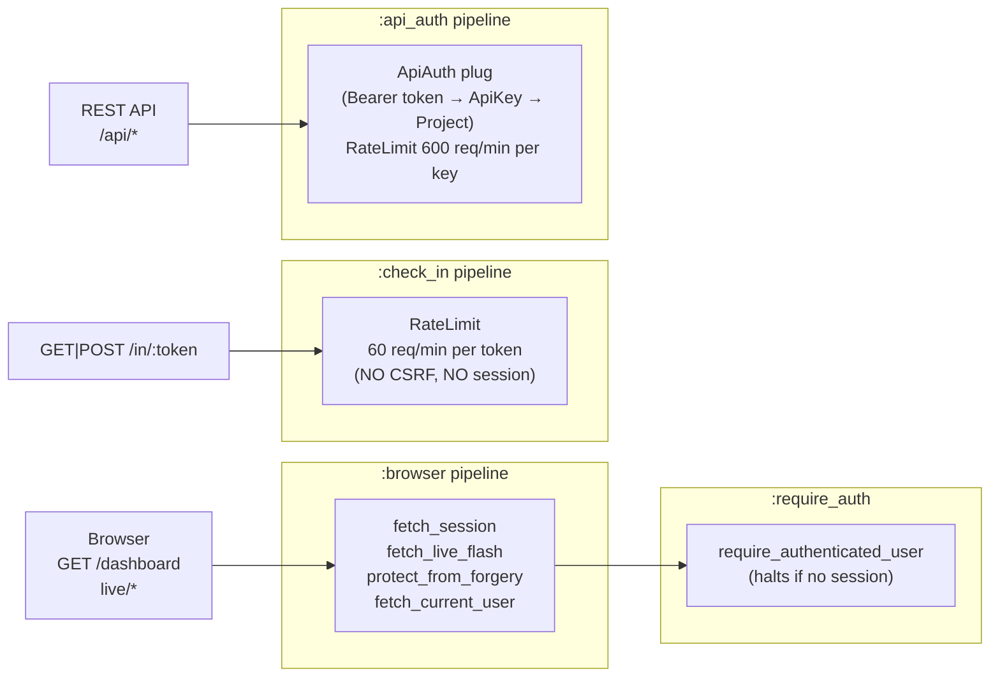
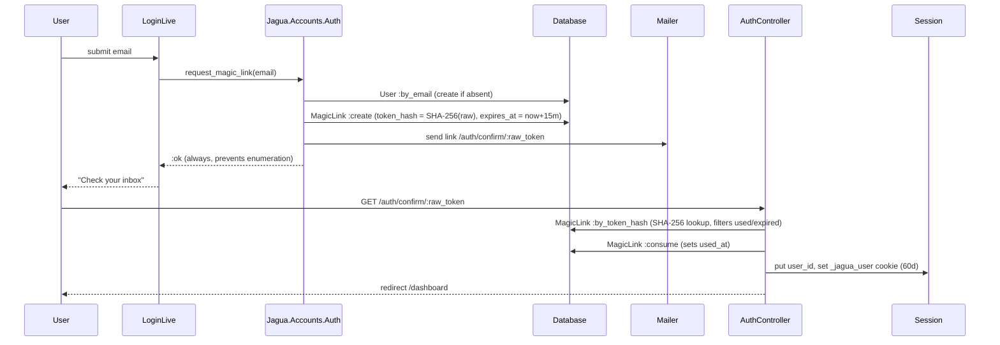
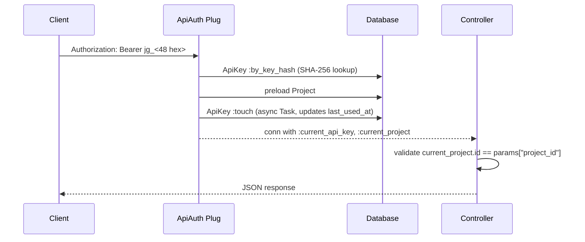
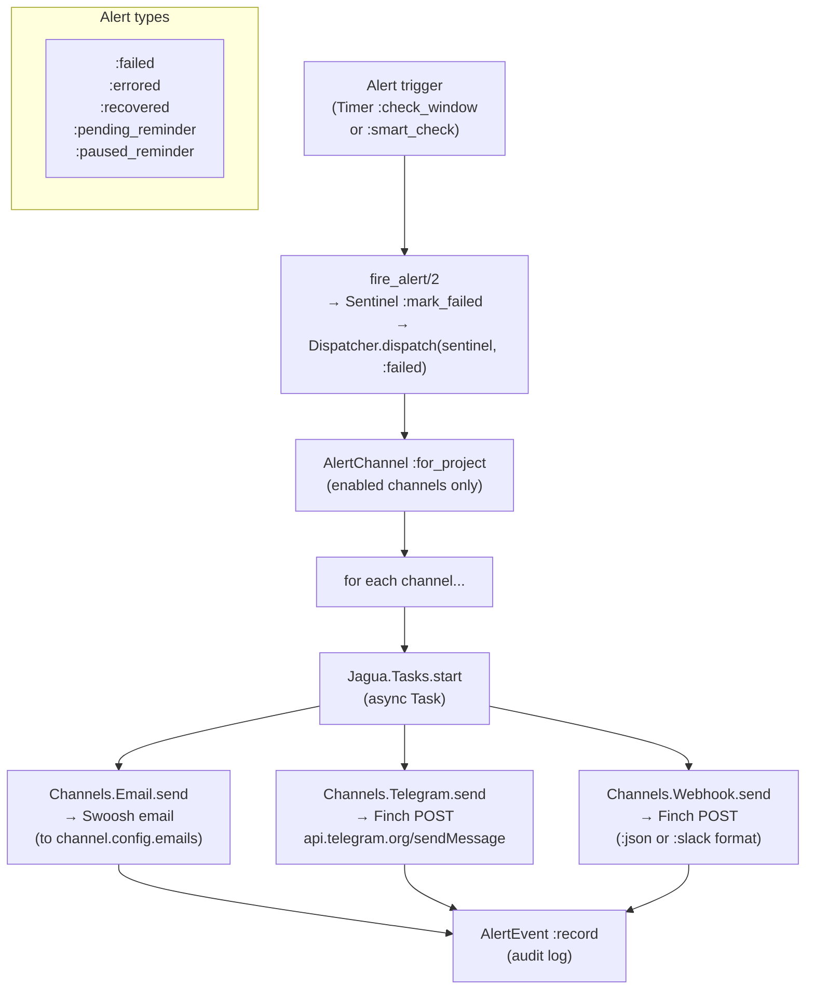

# Jagua Architecture

Jagua is a Dead Man's Snitch-style cron job monitor built with Elixir/Phoenix, Ash Framework, Phoenix LiveView, and PostgreSQL. Jobs ping an HTTP endpoint on each run; if a ping is missed, alerts fire.

---

## Table of Contents

1. [OTP Supervision Tree](#otp-supervision-tree)
2. [Sentinel Lifecycle](#sentinel-lifecycle)
3. [Data Model (Ash Domains)](#data-model-ash-domains)
4. [Request Paths](#request-paths)
5. [Authentication Flows](#authentication-flows)
6. [Alert Dispatching](#alert-dispatching)
7. [Key Design Decisions](#key-design-decisions)

---

## OTP Supervision Tree

### Sentinel.Timer internals

Each `Sentinel.Timer` is a `:transient` GenServer registered via `{:via, Registry, {Jagua.Sentinel.Registry, sentinel_id}}`. It holds three concurrent timers in its state:

**Window boundary model:** all sentinels sharing the same interval evaluate at the same UTC wall-clock tick (e.g., all `:hourly` sentinels at `:00` each hour). Windows are *not* rolling from creation time — this mirrors Dead Man's Snitch behavior.

---

## Sentinel Lifecycle

### Check-in endpoint flow

---

## Data Model (Ash Domains)

### Ash domains

| Domain | Resources |
|---|---|
| `Jagua.Accounts` | `User`, `MagicLink`, `PasskeyCredential` |
| `Jagua.Projects` | `Project`, `Membership` |
| `Jagua.Sentinels` | `Sentinel`, `CheckIn` |
| `Jagua.Alerts` | `AlertChannel`, `AlertEvent` |
| `Jagua.ApiKeys` | `ApiKey` |

---

## Request Paths

### Router pipelines

### All routes at a glance

| Path | Handler | Auth |
|---|---|---|
| `GET /` | `PageController :home` | public |
| `GET /auth/confirm/:token` | `AuthController :confirm` | public |
| `DELETE /auth/logout` | `AuthController :logout` | public |
| `GET /status/:slug` | `Live.StatusPageLive` | public |
| `GET /login` | `Live.LoginLive` | public (redirect if authed) |
| `GET\|POST /in/:token` | `CheckInController :check_in` | token-based, rate-limited |
| `GET /dashboard` | `Live.DashboardLive` | session |
| `GET /projects/new` | `Live.ProjectLive.New` | session |
| `GET /projects/:slug` | `Live.ProjectLive.Show` | session |
| `GET /projects/:slug/sentinels/new` | `Live.SentinelLive.New` | session |
| `GET /projects/:slug/sentinels/:token` | `Live.SentinelLive.Show` | session |
| `GET /projects/:slug/settings` | `Live.ProjectLive.Settings` | session |
| `GET /projects/:slug/api-keys` | `Live.ApiKeysLive` | session |
| `GET /settings` | `Live.SettingsLive` | session |
| `GET\|POST\|PATCH\|DELETE /api/projects` | `Api.ProjectController` | Bearer token |
| `GET\|POST\|PATCH\|DELETE /api/projects/:id/sentinels/:token` | `Api.SentinelController` | Bearer token |
| `GET /api/projects/:id/sentinels/:token/check_ins` | `Api.CheckInController` | Bearer token |

---

## Authentication Flows

### Magic link (browser auth)

### API Bearer token auth

---

## Alert Dispatching

### Alert channel types

| Type | Config fields | Delivery |
|---|---|---|
| `:email` | `emails` (list) | Swoosh via SMTP |
| `:telegram` | `bot_token`, `chat_id` | Finch → Telegram Bot API (MarkdownV2) |
| `:webhook` | `url`, `format` (`:json`/`:slack`) | Finch POST with JSON payload |

---

## Key Design Decisions

### 1. Fixed UTC window boundaries

All sentinels with the same interval share global wall-clock boundaries (`Jagua.Sentinel.Schedule`). An `:hourly` sentinel fires its check at `:00` every hour regardless of when it was created — not 60 minutes from creation. This matches Dead Man's Snitch semantics and makes missed-window reasoning simpler.

### 2. Smart alert mode

When `alert_type == :smart` and the sentinel has at least 5 historical check-ins, the Timer computes `µ + 2σ` of the observed offsets within each window and schedules a `:smart_check` message at that time. This fires the alert *before* the window closes if the job is statistically very late, reducing MTTD.

### 3. Pending sentinels never fail

A sentinel in `:pending` state (no check-in ever received) cannot transition to `:failed`. All alert dispatch paths guard on `state.status != :pending`. This prevents false alerts for newly created monitors before the first run of the job.

### 4. No raw credential storage

- **API keys**: only `prefix` (12 chars, safe to display) + `key_hash` (SHA-256) stored. Raw key shown once in the UI.
- **Magic links**: only `token_hash` (SHA-256) stored. Raw token travels only in the email link.
- **Check-in tokens**: stored in plaintext (they are not secrets — they identify a sentinel, not a user).

### 5. Async tasks for non-critical work

`Jagua.Tasks.start/1` wraps `Task.start` for fire-and-forget work (alert sends, `last_used_at` touches). In test mode (`config :jagua, async_tasks: false`) it runs synchronously to avoid Ecto sandbox teardown races.

### 6. Open registration

`Auth.request_magic_link/1` creates a `User` record if the email is unknown. There is no separate sign-up form. The response is always `:ok` to prevent email enumeration attacks.

### 7. Rate limiting

`Jagua.RateLimiter` uses an ETS table with atomic counters (fixed-window, no GenServer call per request). Fails open if the ETS table is unavailable. Two tiers:
- Check-in endpoint: 60 req/min keyed by sentinel token
- REST API: 600 req/min keyed by API key ID
