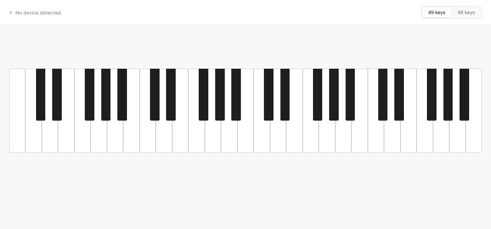

# piano-v1

Browser-based piano that detects your MIDI controller and lets you play immediately.



## Requirements

- **Chrome** (Web MIDI API is not supported in Firefox)
- A MIDI controller — built for the [Novation Launchkey 49 MK3](https://novationmusic.com/products/launchkey-49-mk3)

## Setup

```bash
npm install
npm run dev
```

Open `http://localhost:5173` in Chrome, plug in your controller, and play.

## Features

- Auto-detects MIDI controller on page load
- Velocity-sensitive synth (piano-like tone via Web Audio API)
- Keys sustain while held, release on lift
- Visual keyboard with **49-key** and **88-key** toggle
- Connect / disconnect notifications
